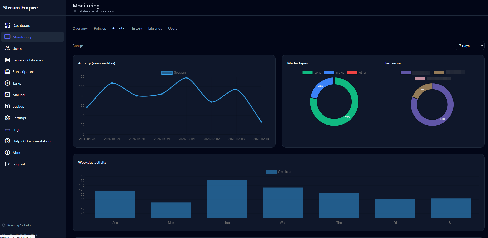

# VODUM

VODUM is a self-hosted administration layer for Plex and Jellyfin. It brings
users, subscriptions, library access, activity monitoring, policies,
communications, migrations and backups into one web interface.

> **Beta:** back up VODUM before every upgrade. Plex support is currently more
> mature than Jellyfin support, and destructive migration automation should be
> validated against your own servers before production use.

## What VODUM does

- Manages users shared across multiple Plex and Jellyfin servers.
- Applies subscription expiration and renewal workflows.
- Grants, removes and restores library access through queued provider jobs.
- Monitors current sessions, playback history, concurrent streams and IP use.
- Enforces stream policies, including warnings and session termination.
- Sends scheduled email and Discord communications with retries.
- Migrates users and access between supported media servers with dry runs,
  validation, pause/resume and source-access rollback.
- Creates and restores SQLite backups, including full backups with attachments
  and the encryption key.
- Imports Tautulli history and protects imports against duplicate sessions.
- Provides an authenticated, multilingual web interface and scheduled task
  engine.

## Requirements

- Docker Engine with Docker Compose, or a compatible container platform.
- A persistent directory for `/appdata`.
- A Plex token and/or Jellyfin API key for each managed server.
- Optional SMTP and Discord credentials for communications.

The published image is `nexius2/vodum:latest`. VODUM listens on container port
`5000`; the included Compose file exposes it as host port `8097`.

## Quick start with Docker Compose

```bash
git clone https://github.com/Nexius2/VODUM.git
cd VODUM
cp .env.example .env
mkdir -p appdata logs backups
docker compose up -d
```

Open `http://YOUR_SERVER_IP:8097` and complete the setup wizard.

The included Compose configuration persists:

| Host path | Container path | Purpose |
|---|---|---|
| `./appdata` | `/appdata` | Database, encryption key and application state |
| `./logs` | `/appdata/logs` | Application and entrypoint logs |
| `./backups` | `/appdata/backups` | Automatic and manual backups |

Follow startup and health information with:

```bash
docker compose logs -f vodum
docker compose ps
```

## Quick start with `docker run`

```bash
mkdir -p "$HOME/vodum/appdata"

docker run -d \
  --name vodum \
  --restart unless-stopped \
  -p 8097:5000 \
  -e TZ=Europe/Paris \
  -e DATABASE_PATH=/appdata/database.db \
  -e VODUM_LOG_DIR=/appdata/logs \
  -e VODUM_BACKUP_DIR=/appdata/backups \
  -v "$HOME/vodum/appdata:/appdata" \
  nexius2/vodum:latest
```

## Configuration

Copy `.env.example` to `.env` when using Compose. Important settings include:

| Variable | Default | Description |
|---|---|---|
| `TZ` | `Europe/Paris` | Container timezone |
| `DATABASE_PATH` | `/appdata/database.db` | SQLite database path |
| `VODUM_LOG_DIR` | `/appdata/logs` | Log directory |
| `VODUM_BACKUP_DIR` | `/appdata/backups` | Backup directory |
| `VODUM_IMPORTS_DIR` | database directory + `/imports` | Uploaded imports and restore requests |
| `VODUM_ENCRYPTION_KEY_FILE` | `/appdata/vodum.encryption_key` | Persistent secret-encryption key |
| `VODUM_PORT` | `5000` | Waitress listening port |
| `VODUM_WAITRESS_THREADS` | `6` | Waitress worker threads |
| `VODUM_MAX_UPLOAD_MB` | `4096` | Maximum complete HTTP request size |
| `VODUM_MAX_ZIP_EXTRACTED_MB` | `8192` | Maximum restored ZIP size after extraction |
| `VODUM_MAX_ZIP_MEMBERS` | `10000` | Maximum number of ZIP entries |
| `VODUM_DEBUG` | `0` | Debug logging and diagnostics |

If `DATABASE_PATH` is changed, keep the database, encryption key, imports,
logs and backups on persistent storage. `VODUM_IMPORTS_DIR` can override the
imports location explicitly.

## Network and security

Authentication is configured during the first-run wizard. VODUM also applies
CSRF protection to state-changing requests and rate-limits failed admin logins.

Access is restricted to private networks by default:

```env
VODUM_IP_FILTER=1
VODUM_ALLOWED_NETS=127.0.0.1/32,10.0.0.0/8,172.16.0.0/12,192.168.0.0/16
```

When VODUM is behind a reverse proxy, trust forwarded headers only from the
proxy network:

```env
VODUM_TRUST_PROXY=1
VODUM_TRUSTED_PROXY_NETS=127.0.0.1/32,::1/128,172.18.0.0/16
```

Use the smallest applicable CIDR, terminate HTTPS at the proxy, and never
publish VODUM or media-server tokens without authentication and firewall
protection.

SMTP passwords, Discord tokens and media-server tokens are encrypted in
SQLite. Full ZIP backups contain both encrypted secrets and their encryption
key, so treat them as credentials. Raw `.db` and `.sqlite` backups do not
contain the key; preserve `vodum.encryption_key` separately when using them.

See the [security guide](https://nexius2.github.io/vodum-docs/security/) for
recovery, proxy and secret-handling details.

## Upgrades and backups

Create a full backup from **Backup & Import** before upgrading, then update the
container:

```bash
docker compose pull
docker compose up -d
docker compose logs -f vodum
```

Database bootstrap and schema migrations run automatically at startup. Do not
interrupt the first startup after an upgrade. If it fails, retain the database,
logs, backup and encryption-key files before attempting recovery.

## Development and validation

Build the current source tree locally:

```bash
docker build -t vodum:local .
docker run --rm -p 8097:5000 -v "$PWD/appdata:/appdata" vodum:local
```

For Python validation outside Docker:

```bash
python -m venv .venv
. .venv/bin/activate
pip install -r requirements.txt

python -m compileall -q app migrations tools
for test in tools/validate_*.py; do python "$test"; done
python tools/smoke_routes.py
python tools/smoke_application_runtime.py
```

The runtime smoke test creates an isolated temporary database. It validates
idempotent bootstrap, foreign keys, template compilation, authentication,
route rendering, CSRF, maintenance mode, brute-force locking and redirect
safety without touching production data.

The Tautulli CLI supports one machine-readable result for automation:

```bash
python app/tasks/import_tautulli.py --help
python app/tasks/import_tautulli.py \
  --tautulli-db /path/to/tautulli.db \
  --summary-only
```

## Documentation and support

- [Full documentation](https://nexius2.github.io/vodum-docs/)
- [Getting started](https://nexius2.github.io/vodum-docs/getting-started/)
- [Backup and restore](https://nexius2.github.io/vodum-docs/backup/)
- [Troubleshooting](https://nexius2.github.io/vodum-docs/troubleshooting/)
- [Discord community](https://discord.gg/5PU7TnegZt)

## Interface preview

<p align="center">
  
  
</p>

<p align="center">
  
  
</p>

## License

VODUM is distributed under the [MIT License](LICENSE).
