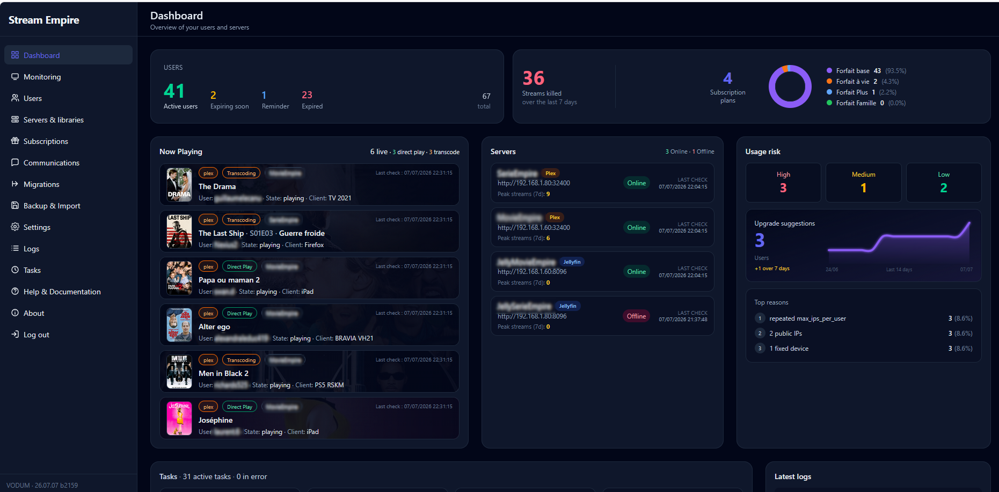
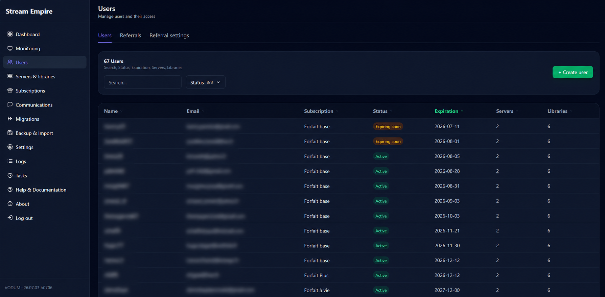
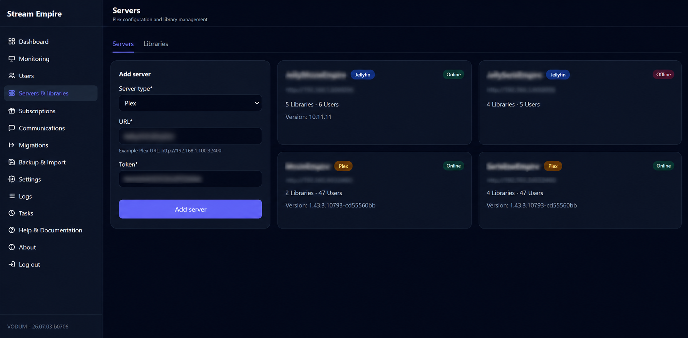
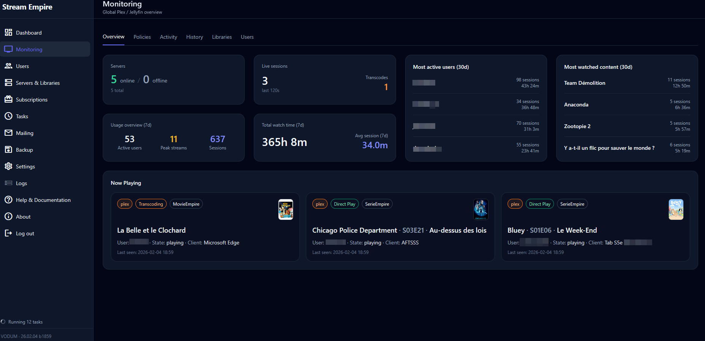
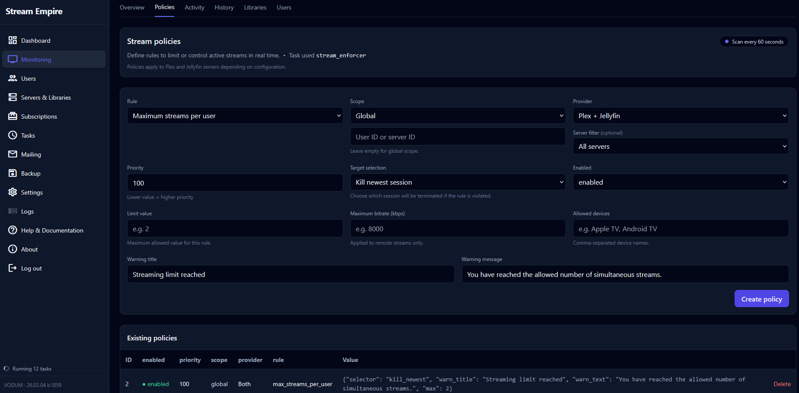
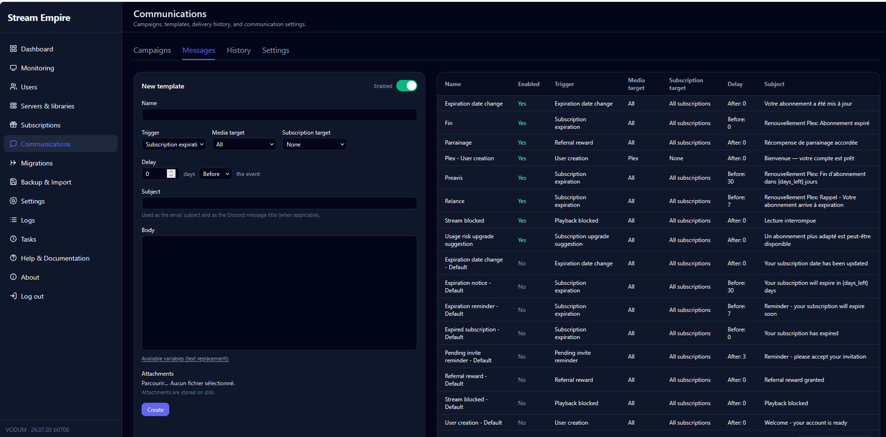

# <p align="center">
<h1 align="center">
VODUM
</h1>

<p align="center">

<strong>The complete self-hosted administration platform for Plex & Jellyfin.</strong>

Manage users, subscriptions, permissions, monitoring, stream policies, migrations and backups from one modern interface.

</p>

<p align="center">

<a href="https://github.com/Nexius2/VODUM/releases">

</a>

<a href="https://github.com/Nexius2/VODUM/blob/main/LICENSE">
    
</a>

<a href="https://hub.docker.com/r/nexius2/vodum">

</a>

<a href="https://github.com/Nexius2/VODUM/stargazers">

</a>

<a href="https://discord.gg/5PU7TnegZt">
</a>

</p>

---

<p align="center">

**Plex • Jellyfin • Multi-Server • Subscription Management • Live Monitoring • Stream Policies • Email & Discord • Automatic Backups • Open Source**

</p>

---

<p align="center">

</p>

---

## Built for media server administrators

Running a shared Plex or Jellyfin server is easy.

Managing **50 users** is not.

Managing **500 users** quickly becomes a full-time job.

VODUM automates the repetitive work so you can spend your time managing your media library instead of your users.

Whether you manage a small family server or a large multi-server community, VODUM centralizes everything into one powerful web interface.

---

# Why VODUM?

Most administrators eventually face the same problems.

❌ Users forget to renew.

❌ Library permissions become difficult to manage.

❌ Shared accounts abuse your server.

❌ Nobody knows who watched what.

❌ Email reminders are sent manually.

❌ Multiple Plex servers become impossible to synchronize.

❌ Jellyfin and Plex require different workflows.

❌ Restoring permissions after a mistake is painful.

---

## VODUM solves all of these.

✔ Centralized user management

✔ Subscription automation

✔ Automatic access synchronization

✔ Multi-server management

✔ Stream abuse detection

✔ Live activity monitoring

✔ Email & Discord notifications

✔ Automated policies

✔ Secure encrypted backups

✔ Migration tools

✔ Tautulli import

✔ Modern responsive interface

---

# Designed for large communities

VODUM was originally created to manage large shared media servers where manual administration simply wasn't sustainable anymore.

Instead of using spreadsheets, scripts and multiple disconnected tools, everything is available from a single dashboard.

Whether you manage:

- your family
- your friends
- a private community
- hundreds of subscribers

VODUM helps you automate nearly every administrative task.

---

# Main Features

## 👥 User Management

Manage every Plex and Jellyfin user from a single interface.

✅ Shared users

✅ Multiple identities

✅ Subscription tracking

✅ Email & Discord accounts

✅ Owner/Admin detection

✅ Bulk operations

<p align="center">

</p>

---

## 📺 Multi-Server Management

Manage multiple Plex and Jellyfin servers simultaneously.

Features include:

- Multi Plex support
- Multi Jellyfin support
- Mixed environments
- Automatic synchronization
- Library mapping
- Server monitoring
- Scheduled synchronization
- Connection testing

<p align="center">

</p>

---

## 📊 Live Monitoring

See exactly what is happening on your servers.

Monitor:

- Active streams
- Transcodes
- Playback history
- Current sessions
- Watch time
- Peak usage
- Library activity
- User activity

<p align="center">

</p>

---

## 🔒 Stream Policies

Automatically enforce your own rules.

Examples:

- Maximum simultaneous streams
- Maximum streams per IP
- Maximum IP addresses
- Automatic warnings
- Stream termination
- Upgrade suggestions
- Usage risk analysis

<p align="center">

</p>

---

## 📧 Communications

Communicate automatically with your users.

- Email templates
- Discord notifications
- Scheduled messages
- Expiration reminders
- Upgrade suggestions
- Retry queue
- Message history

<p align="center">

</p>

---

## 🔄 Migration

Move users between servers safely.

Features:

- Dry-run mode
- Validation
- Rollback
- Pause / Resume
- Progress monitoring
- Access verification

---

## 💾 Backup & Restore

Protect your installation.

- Automatic backups
- Manual backups
- ZIP archives
- SQLite backups
- Encryption key export
- Full restore

---

## 🌎 International

VODUM currently supports:

- 🇬🇧 English
- 🇫🇷 French
- 🇪🇸 Spanish
- 🇮🇹 Italian
- 🇩🇪 German

---

# Installation

VODUM installs in less than two minutes.

## Docker Compose

```bash
git clone https://github.com/Nexius2/VODUM.git

cd VODUM

cp .env.example .env

mkdir -p appdata logs backups

docker compose up -d
```

Open your browser:

```
http://YOUR_SERVER_IP:8097
```

Complete the setup wizard.

---

## Docker Run

```bash
mkdir -p "$HOME/vodum/appdata"

docker run -d \
  --name vodum \
  --restart unless-stopped \
  -p 8097:5000 \
  -e TZ=Europe/Paris \
  -e DATABASE_PATH=/appdata/database.db \
  -e VODUM_LOG_DIR=/appdata/logs \
  -e VODUM_BACKUP_DIR=/appdata/backups \
  -v "$HOME/vodum/appdata:/appdata" \
  nexius2/vodum:latest
```

---

## Docker Compose Volumes

| Host | Container | Description |
|-------|-----------|-------------|
| ./appdata | /appdata | Database, encryption key, configuration |
| ./logs | /appdata/logs | Application logs |
| ./backups | /appdata/backups | Automatic and manual backups |

---

## First Startup

During the first launch VODUM automatically:

- Creates the database
- Generates encryption keys
- Initializes scheduled tasks
- Starts the web interface
- Launches the setup wizard

No manual configuration is required before accessing the interface.

---

# Configuration

VODUM is designed to work out of the box with sensible defaults while remaining highly configurable for advanced deployments.

When using Docker Compose, copy `.env.example` to `.env` and adjust the values according to your environment.

## Core Configuration

| Variable | Default | Description |
|-----------|----------|-------------|
| `TZ` | `Europe/Paris` | Container timezone |
| `DATABASE_PATH` | `/appdata/database.db` | SQLite database location |
| `VODUM_LOG_DIR` | `/appdata/logs` | Application logs |
| `VODUM_BACKUP_DIR` | `/appdata/backups` | Backup storage |
| `VODUM_IMPORTS_DIR` | `/appdata/imports` | Imported files |
| `VODUM_ENCRYPTION_KEY_FILE` | `/appdata/vodum.encryption_key` | Encryption key |
| `VODUM_PORT` | `5000` | Internal web server port |
| `VODUM_WAITRESS_THREADS` | `6` | Web server worker threads |
| `VODUM_MAX_UPLOAD_MB` | `4096` | Maximum upload size |
| `VODUM_MAX_ZIP_EXTRACTED_MB` | `8192` | Maximum extracted backup size |
| `VODUM_MAX_ZIP_MEMBERS` | `10000` | Maximum archive entries |
| `VODUM_DEBUG` | `0` | Enable debug mode |

> **Recommendation**
>
> Keep your database, encryption key and backups on persistent storage.
> Never store them inside ephemeral Docker layers.

---

# Supported Providers

VODUM currently supports:

| Provider | Status |
|-----------|--------|
| Plex | ✅ Fully supported |
| Jellyfin | ✅ Supported |
| Tautulli Import | ✅ Supported |

Future providers may be added as the project evolves.

---

# Security

Security has been a primary design goal since the beginning of the project.

VODUM protects both administrators and users through multiple layers of security.

## Authentication

- Secure administrator authentication
- Password hashing
- Session protection
- Automatic session expiration
- Login rate limiting
- Brute-force protection

---

## CSRF Protection

Every state-changing request is protected against Cross-Site Request Forgery attacks.

---

## IP Filtering

By default, VODUM only accepts connections from private networks.

```env
VODUM_IP_FILTER=1

VODUM_ALLOWED_NETS=127.0.0.1/32,10.0.0.0/8,172.16.0.0/12,192.168.0.0/16
```

---

## Reverse Proxy Support

Running behind Nginx, Traefik or Caddy?

Simply enable trusted proxy mode.

```env
VODUM_TRUST_PROXY=1

VODUM_TRUSTED_PROXY_NETS=127.0.0.1/32,::1/128,172.18.0.0/16
```

Always expose VODUM through HTTPS.

---

## Secret Encryption

Sensitive information is encrypted before being stored.

This includes:

- Plex tokens
- Jellyfin API keys
- SMTP passwords
- Discord tokens

The encryption key is stored separately from the database.

> **Important**
>
> Full ZIP backups include both encrypted data and the encryption key.
> Store backup files securely.

---

# Backup & Restore

Protecting your media server configuration is just as important as protecting your media.

VODUM provides a complete backup solution.

## Backup Types

✅ Full encrypted backup

✅ SQLite backup

✅ Automatic scheduled backups

✅ Manual backups

✅ ZIP export

---

## Restore

Restore an entire installation in just a few clicks.

The restore process automatically recovers:

- Database
- Configuration
- Encryption keys
- Messages
- Tasks
- Policies
- Users
- Subscriptions

---

# Monitoring

VODUM continuously monitors your media servers.

Available dashboards include:

- Active sessions
- Playback history
- Concurrent streams
- User activity
- Peak usage
- Watch time
- Library statistics
- Server health

Everything is updated automatically through the background task engine.

---

# Automation

One of VODUM's biggest strengths is automation.

Examples include:

- Automatic user synchronization
- Subscription expiration
- Email reminders
- Discord notifications
- Library access updates
- Stream policy enforcement
- Usage risk analysis
- Automatic backups

Once configured, most administrative work becomes automatic.

---

# Migration

Migrating users between servers no longer requires manual work.

VODUM includes a complete migration engine.

Features include:

- Dry Run
- Validation
- Pause / Resume
- Rollback
- Progress monitoring
- Access verification
- Automatic restoration

Whether migrating a few users or an entire server, VODUM minimizes downtime and reduces the risk of mistakes.

---

# Scheduled Tasks

VODUM includes a built-in scheduler responsible for all background operations.

Examples include:

- User synchronization
- Session monitoring
- Email delivery
- Policy enforcement
- Backup creation
- Cleanup tasks
- Notification processing

Tasks can be enabled, disabled and monitored directly from the web interface.

---

# Development

Clone the repository:

```bash
git clone https://github.com/Nexius2/VODUM.git

cd VODUM
```

Build locally:

```bash
docker build -t vodum:local .

docker run --rm \
-p 8097:5000 \
-v "$PWD/appdata:/appdata" \
vodum:local
```

Python validation:

```bash
python -m venv .venv

source .venv/bin/activate

pip install -r requirements.txt

python -m compileall -q app migrations tools

python tools/smoke_routes.py

python tools/smoke_application_runtime.py

python app/tasks/import_tautulli.py --summary-only --help
```

---

# Documentation

Complete documentation is available online.

- 📖 Getting Started
- ⚙ Configuration
- 🔒 Security
- 💾 Backup & Restore
- 🔄 Migration
- 🛠 Troubleshooting

https://nexius2.github.io/vodum-docs/

---

# Community

Join the Discord community.

Report bugs.

Suggest features.

Share your feedback.

https://discord.gg/5PU7TnegZt

---

# Roadmap

The project continues to evolve.

Current focus includes:

- Improved Jellyfin support
- Additional monitoring dashboards
- New automation features
- Better migration workflows
- UI improvements
- Performance optimizations
- API improvements

Community suggestions are always welcome.

---

# Contributing

Contributions of all sizes are welcome.

You can help by:

- Reporting bugs
- Improving documentation
- Translating the interface
- Submitting Pull Requests
- Suggesting new features

Every contribution helps make VODUM better.

---

# Frequently Asked Questions

## Is VODUM free?

Yes.

VODUM is completely open source under the MIT License.

---

## Does VODUM replace Plex or Jellyfin?

No.

VODUM acts as an administration layer on top of your existing media servers.

---

## Can I manage multiple servers?

Yes.

VODUM supports multiple Plex and Jellyfin servers simultaneously.

---

## Does VODUM modify my media?

Never.

Only user management and server administration are performed.

Your media library remains untouched.

---

## Is Docker required?

Docker is the recommended installation method.

---

# License

## ❤️ Support the Project

If VODUM helps you manage your Plex or Jellyfin servers, please consider giving the repository a ⭐ on GitHub.

It costs nothing, takes only a second, and helps the project become more visible to the self-hosted community.

Thank you for your support!

---

Released under the MIT License.