<p align="center">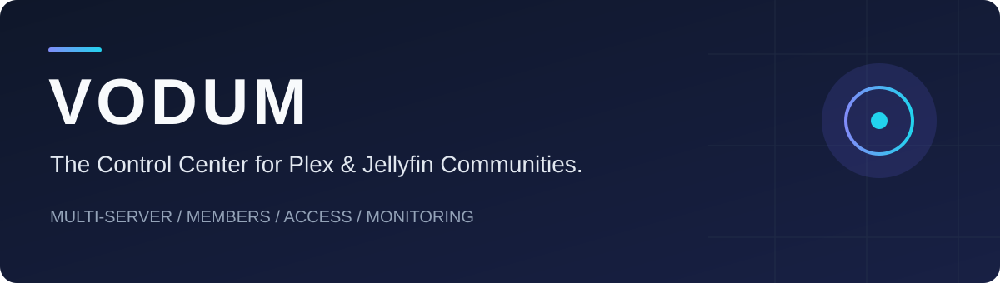</p>

<p align="center">
<a href="LICENSE"></a>
<a href="https://hub.docker.com/r/nexius2/vodum"></a>
<a href="https://github.com/Nexius2/VODUM"></a>
<a href="https://github.com/Nexius2/VODUM/commits"></a>
</p>

<p align="center">
<a href="https://nexius2.github.io/vodum-docs/">Documentation</a> · <a href="https://hub.docker.com/r/nexius2/vodum">Docker Hub</a> · <a href="https://discord.gg/5PU7TnegZt">Discord</a> · <a href="https://github.com/Nexius2/VODUM/issues">Report an issue</a>
</p>

# VODUM

**The Control Center for Plex & Jellyfin Communities.**

VODUM is an open source, self-hosted administration platform for people running Plex and Jellyfin communities. Bring servers, users, library permissions, subscriptions and streaming activity together in one place—and give members a portal of their own.

Spend less time switching between dashboards. See who has access, when it expires, what is playing and which accounts need attention. Connect Radarr and Sonarr for media requests, communicate with members, and keep your administration data backed up.

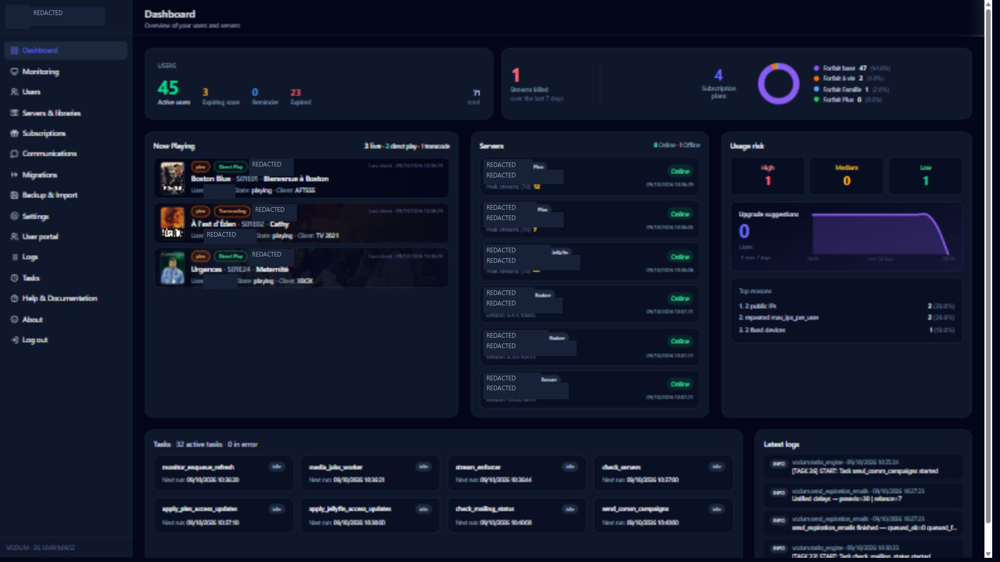

*Real desktop captures from VODUM. Private information is masked; counts and activity reflect the captured instance. [Browse all screenshots](screenshots/README.md).*

[Features](#features) · [User Portal](#a-portal-for-your-members) · [Docker](#install-with-docker) · [Unraid](#install-on-unraid) · [Configuration](#configuration) · [Contributing](#contributing)

## Features

| Area | What you can do |
| --- | --- |
| **Plex & Jellyfin** | Manage multiple servers, inspect libraries and review member access across providers. |
| **Users & access** | Manage account details, library permissions, status, expiry dates and referrals. |
| **Subscriptions** | Define plans, durations and limits; follow renewals and expiration workflows. |
| **Streaming policies** | Configure simultaneous-stream and IP limits; inspect violations and enforcement events. |
| **Monitoring** | Follow current playback, historical activity, usage risk, users, libraries and server statistics. |
| **User Portal** | Offer account details, media access, subscriptions, personal activity and support. |
| **Media requests** | Search movies and series through Radarr/Sonarr and configure request destinations. |
| **Communications** | Prepare targeted campaigns, use templates and manage portal conversations. |
| **Administration** | Run scheduled tasks, inspect logs, create backups and import Tautulli history. |
| **Migration tools** | Prepare and analyze access migration plans, with execution controls and access snapshots. |

Availability depends on connected providers, their APIs and your configuration. Portal modules and authentication methods are optional. Planned work is tracked separately in [TODO.md](TODO.md).

### One view across your servers

Connect Plex and Jellyfin servers, inspect connection health and manage access to individual libraries. A user can have access on more than one server; VODUM brings those relationships into one administration interface.

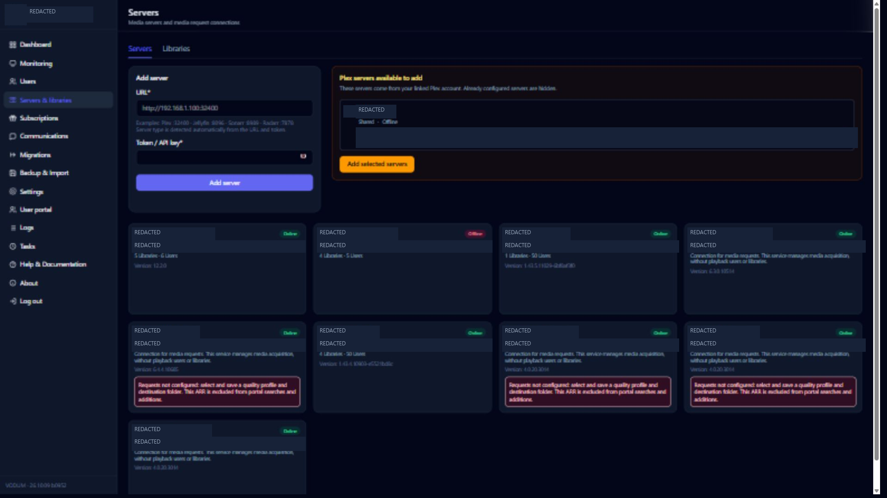

[Servers & libraries guide](vodum-docs/docs/servers-libraries.md) · [Libraries screenshot](screenshots/libraries.png)

### Manage the member lifecycle

Keep user details, plans, expiration dates, server access and library permissions together. Subscription settings and scheduled tasks support renewal reminders and expiration handling. Invitations and referral relationships help onboard members and track who invited whom.

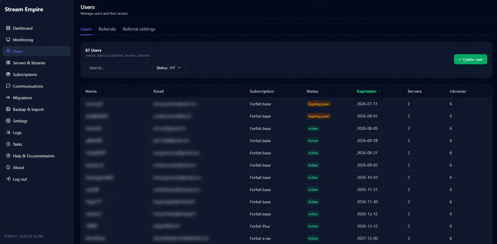

[Users](vodum-docs/docs/users.md) · [Subscriptions](vodum-docs/docs/subscriptions.md) · [Scheduled tasks](vodum-docs/docs/tasks.md)

### Streaming policies and visibility

Set streaming limits and review policy events alongside playback activity. The monitoring workspace includes Now Playing, usage risk, activity, history and views by user, library and server. Provider capabilities determine which details are available.

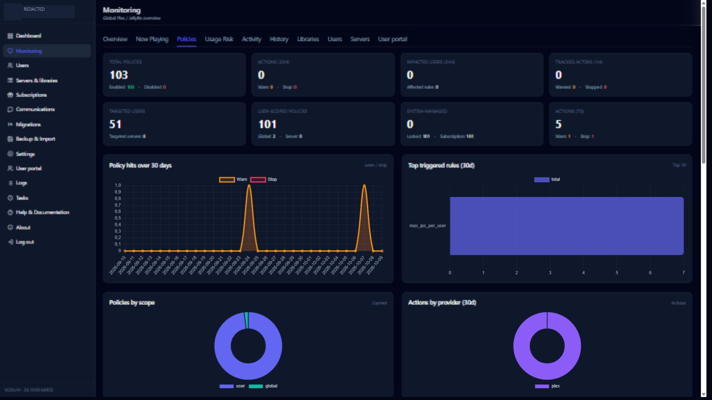

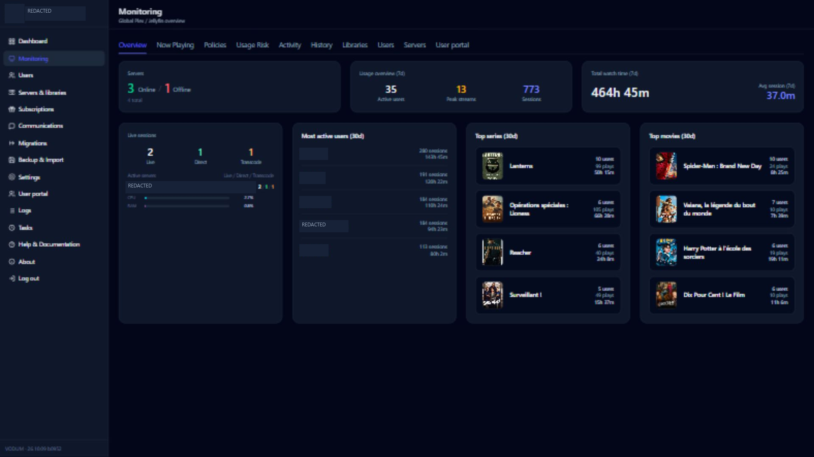

[Policies](vodum-docs/docs/policies.md) · [Monitoring](vodum-docs/docs/monitoring.md) · [Activity screenshot](screenshots/activity.png)

### A portal for your members

Give members a simpler place to manage their account. **My profile** brings personal information, connection details and media access together. Separate pages cover subscriptions, personal activity, media requests and help, according to the modules you enable.

Portal authentication can use local credentials, Plex or Jellyfin when configured. Administrators can preview a member's portal to check the experience.

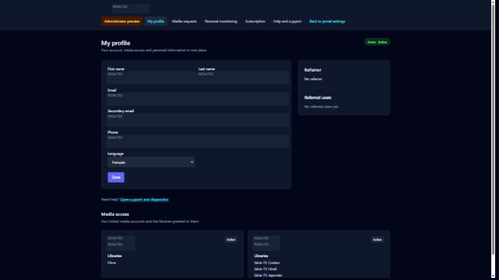

The subscription page shows the plan, expiry and included limits. Its friend-invitation workflow can inherit the inviter's access, plan, expiry and limits, and record the referral relationship.

[User Portal guide](vodum-docs/docs/user-portal.md) · [Portal permissions](vodum-docs/docs/user-portal-permissions.md) · [Subscription screenshot](screenshots/portal-subscription.png)

### Media requests with Radarr and Sonarr

Connect Radarr for movies and Sonarr for series. Configure quality profiles, root folders and library associations to prepare request destinations. The portal provides media search and request controls, subject to enabled modules and member permissions.

[View the media search screenshot](screenshots/media-requests.png)

*This capture uses the administrator preview: request submission is intentionally disabled there. Search was verified without submitting a request. The deployed ARR settings screen still labels advanced portal-routing hookup as upcoming; validate those routing controls for your version before relying on them.*

[ARR settings screenshot](screenshots/radarr-routing.png) · [Portal guide](vodum-docs/docs/user-portal.md)

### Communication, backups and migration tools

Prepare campaigns for selected groups and channels, use message templates and follow portal conversations. Backup tools expose retention settings, database checks, backup creation and restore controls. Tautulli import brings historical playback information into VODUM, with duplicate handling.

Migration tools provide plans, analysis, execution controls and access snapshots. Review provider-specific limitations before applying changes; snapshots do not imply every external action can be undone.

[Communications](vodum-docs/docs/communications.md) · [Backups](vodum-docs/docs/backup.md) · [Migrations](vodum-docs/docs/migrations.md)

<details>
<summary>More interface screenshots</summary>

| Communications | Backups & imports |
| --- | --- |
| 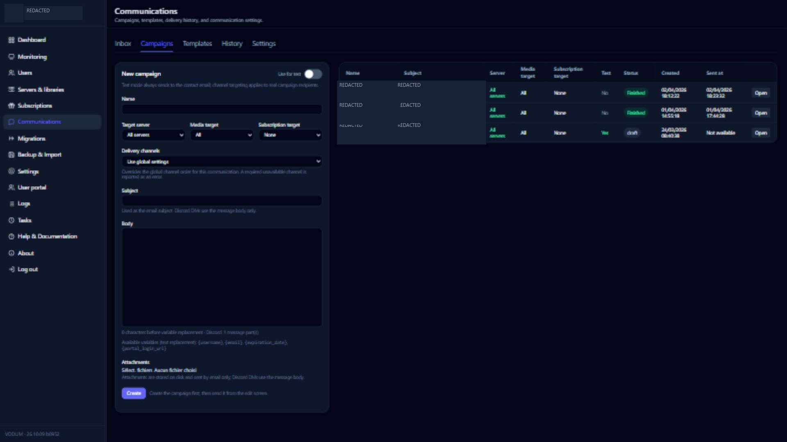 | 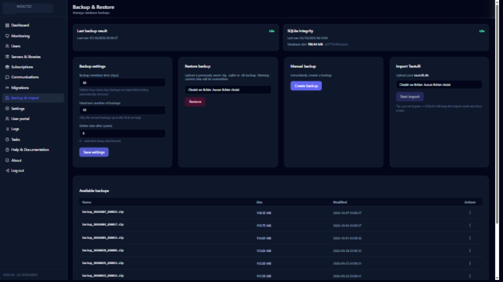 |

| Migration plans | General settings |
| --- | --- |
| 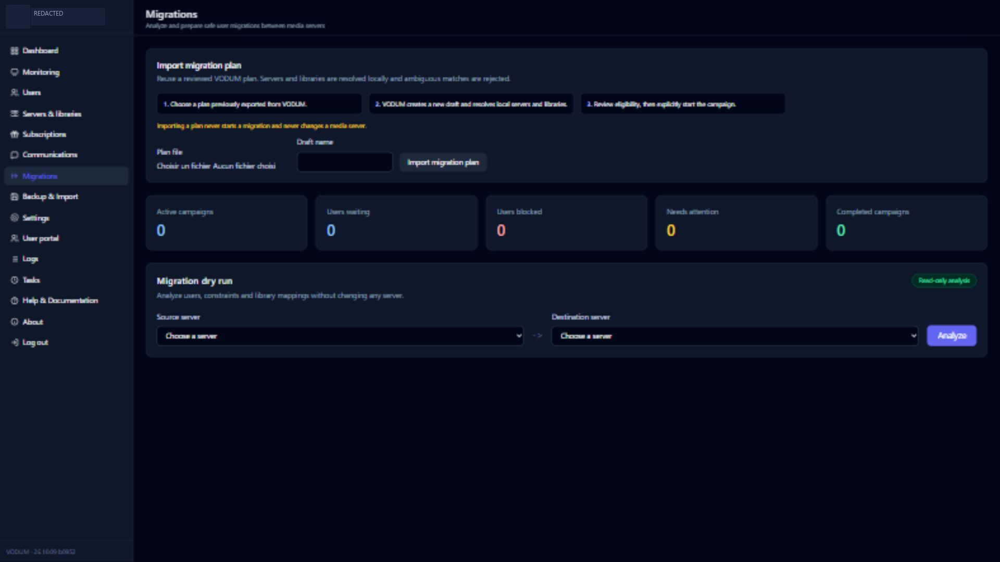 | 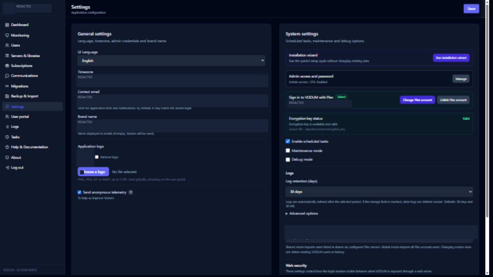 |

</details>

## Install with Docker

You need Docker with the Compose plugin and network access from the container to your media servers. The published image is [`nexius2/vodum:latest`](https://hub.docker.com/r/nexius2/vodum).

```bash
git clone https://github.com/Nexius2/VODUM.git
cd VODUM
cp .env.example .env
mkdir -p appdata logs backups
```

Review `.env` before starting, especially the timezone, allowed networks and trusted proxy settings. Then run:

```bash
docker compose up -d
```

Open **http://YOUR_SERVER_IP:8097** and complete the initial administrator setup. The supplied [Compose file](docker-compose.yml) maps host port `8097` to container port `5000` and includes a `/health` check.

### Persistent storage

| Host path in Compose | Container path | Contents |
| --- | --- | --- |
| `./appdata` | `/appdata` | SQLite database, encryption key and persistent application data |
| `./logs` | `/appdata/logs` | Application logs |
| `./backups` | `/appdata/backups` | Backup files |

Keep these directories when recreating or updating the container.

### Docker run alternative

```bash
docker run -d \
  --name vodum \
  --restart unless-stopped \
  -p 8097:5000 \
  -e TZ=Europe/Paris \
  -e DATABASE_PATH=/appdata/database.db \
  -e VODUM_LOG_DIR=/appdata/logs \
  -e VODUM_BACKUP_DIR=/appdata/backups \
  -v "$HOME/vodum/appdata:/appdata" \
  nexius2/vodum:latest
```

### Update an existing installation

Create a backup first, then update the image and recreate the container:

```bash
docker compose pull
docker compose up -d
docker compose logs --tail=100 vodum
```

## Install on Unraid

Use the repository's [Unraid template](vodum.xml), or add a container from Unraid's Docker tab with:

| Setting | Value |
| --- | --- |
| Repository | `nexius2/vodum:latest` |
| Web UI | `http://[IP]:[PORT:5000]` |
| Port | Host `8097` → container `5000` |
| Appdata | `/mnt/user/appdata/vodum` → `/appdata` |
| Timezone | Set `TZ` to your timezone |

For a single appdata mount, use `/appdata/logs` and `/appdata/backups` as log and backup paths. If you keep the template's separate `/logs` and `/backups` mounts, set `VODUM_LOG_DIR=/logs` and `VODUM_BACKUP_DIR=/backups` to match them.

[Unraid support thread](https://forums.unraid.net/topic/196501-support-nexius2-vodum/)

## Configuration

Use [`.env.example`](.env.example) as the starting point. Configure integrations, subscriptions, communications and portal modules through the administrator interface.

<details>
<summary>Environment variable reference</summary>

| Variable | Default / example | Purpose |
| --- | --- | --- |
| `TZ` | `Europe/Paris` | Container timezone |
| `DATABASE_PATH` | `/appdata/database.db` | SQLite database location |
| `VODUM_LOG_DIR` | `/appdata/logs` | Logs directory |
| `VODUM_BACKUP_DIR` | `/appdata/backups` | Backups directory |
| `VODUM_IMPORTS_DIR` | `imports` next to the database | Import staging directory |
| `VODUM_ENCRYPTION_KEY_FILE` | `/appdata/vodum.encryption_key` | Key for encrypted stored secrets |
| `VODUM_PORT` | `5000` | Container HTTP port |
| `VODUM_WAITRESS_THREADS` | `6` | HTTP worker threads |
| `VODUM_HTTP_GZIP_LEVEL` | `6` | Text compression level, 1–9 |
| `VODUM_BACKUP_SNAPSHOT_TIMEOUT_SECONDS` | `300` | SQLite snapshot time limit |
| `VODUM_MAX_UPLOAD_MB` | `4096` | Upload size limit |
| `VODUM_MAX_ZIP_EXTRACTED_MB` | `8192` | Extracted ZIP size limit |
| `VODUM_MAX_ZIP_MEMBERS` | `10000` | ZIP entry count limit |
| `VODUM_DEBUG` | `0` | Debug mode |
| `VODUM_IP_FILTER` | `1` | Enable source-network filtering |
| `VODUM_ALLOWED_NETS` | Private networks; see below | Allowed client networks |
| `VODUM_TRUST_PROXY` | Set for your deployment | Trust forwarded headers behind a configured proxy |
| `VODUM_TRUSTED_PROXY_NETS` | Actual proxy CIDRs | Networks allowed to provide forwarded headers |
| `VODUM_ADMIN_PUBLIC_URL` | Empty | Optional separate public administrator URL |

</details>

### Network access and reverse proxies

The default allowed IPv4 networks cover loopback and private LANs:

```dotenv
VODUM_IP_FILTER=1
VODUM_ALLOWED_NETS=127.0.0.1/32,10.0.0.0/8,172.16.0.0/12,192.168.0.0/16
```

When using a reverse proxy, configure trusted networks to match your actual proxy addresses. The example environment enables proxy trust; review it before deployment. For example, a proxy on the indicated Docker network could use:

```dotenv
VODUM_TRUST_PROXY=1
VODUM_TRUSTED_PROXY_NETS=127.0.0.1/32,::1/128,172.18.0.0/16
```

Use HTTPS for public access and configure the portal's public URL and secure-cookie settings consistently. `VODUM_ADMIN_PUBLIC_URL` supports separate administrator and portal hosts: administrator routes are refused on the portal host when this separation is configured.

### Secrets and backup recovery

VODUM encrypts stored secrets using its encryption key. Preserve the key alongside the database for recovery. A full backup ZIP includes the database, attachments and key; **the ZIP archive itself is not encrypted**. Restrict access to backup files. A raw database copy alone cannot recover encrypted secrets without the matching key.

[Configuration](vodum-docs/docs/configuration.md) · [Security](vodum-docs/docs/security.md) · [Backups](vodum-docs/docs/backup.md)

## Documentation and support

Start with the [online documentation](https://nexius2.github.io/vodum-docs/) or the guides included in this repository:

- [Getting started](vodum-docs/docs/getting-started.md)
- [Users](vodum-docs/docs/users.md) and [subscriptions](vodum-docs/docs/subscriptions.md)
- [User Portal](vodum-docs/docs/user-portal.md) and [permissions](vodum-docs/docs/user-portal-permissions.md)
- [Monitoring](vodum-docs/docs/monitoring.md), [policies](vodum-docs/docs/policies.md) and [logs](vodum-docs/docs/logs.md)
- [Communications](vodum-docs/docs/communications.md), [tasks](vodum-docs/docs/tasks.md) and [migrations](vodum-docs/docs/migrations.md)
- [Troubleshooting](vodum-docs/docs/troubleshooting.md) and [FAQ](vodum-docs/docs/faq.md)

The interface includes English, French, Spanish, Italian and German translations.

Join [Discord](https://discord.gg/5PU7TnegZt), ask in the [Unraid support thread](https://forums.unraid.net/topic/196501-support-nexius2-vodum/), or open a [GitHub issue](https://github.com/Nexius2/VODUM/issues). Include your VODUM version, relevant provider versions and sanitized logs when reporting a problem.

If VODUM helps you run your community, [support its development](https://buymeacoffee.com/vodum) or [star the project](https://github.com/Nexius2/VODUM).

## Contributing

Bug reports, documentation improvements, translations and code contributions are welcome. Discuss substantial changes in an issue first and check [TODO.md](TODO.md) for planned work.

### Local development

```bash
python -m venv .venv
source .venv/bin/activate
# Windows PowerShell: .venv\Scripts\Activate.ps1
pip install -r requirements.txt
python -m compileall -q app migrations tools
python tools/smoke_routes.py
python tools/smoke_application_runtime.py
python app/tasks/import_tautulli.py --summary-only --help
```

Use a disposable development database and configuration when running checks. For CSS changes, install frontend dependencies and rebuild the stylesheet:

```bash
pnpm install --frozen-lockfile
pnpm build:css
```

To build and run the container locally:

```bash
docker build -t vodum:local .
docker run --rm -p 8097:5000 -v "$PWD/appdata:/appdata" vodum:local
```

VODUM complements Plex, Jellyfin, Radarr and Sonarr; it does not replace their media-serving or acquisition engines. Optional request workflows can instruct ARR services to acquire media.

## License

VODUM is distributed under the [MIT License](LICENSE). Plex, Jellyfin, Radarr and Sonarr belong to their respective projects; VODUM is an independent community project.
